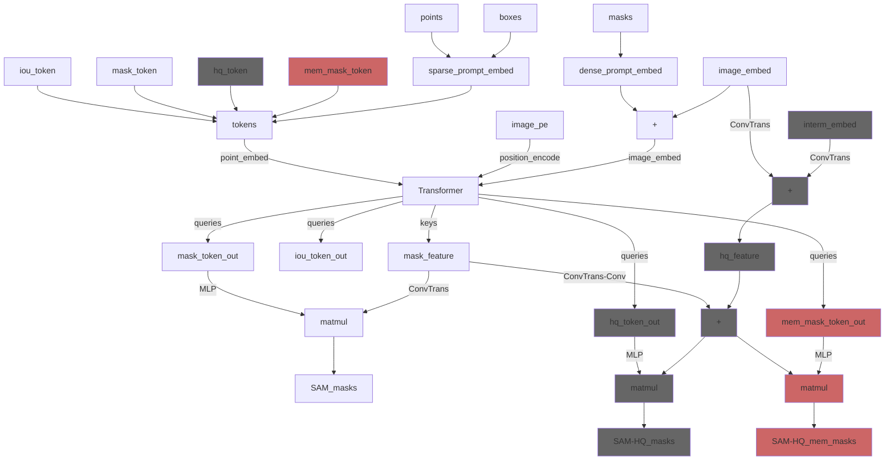

# SAEM<sup>2</sup>-SAvEM<sup>3</sup>

[](https://github.com/JackieZhai/SAvEM3/commits)


**Hao Zhai\*, Jinyue Guo\*, Yanchao Zhang\*, Jing Liu, Hua Han**

*Key Laboratory of Brain Cognition and Brain-inspired Intelligence Technology, Institute of Automation, Chinese Academy of Science* <br>
*School of Future Technology, School of Artificial Intelligence, University of Chinese Academy of Sciences*

## To-do List

Codes and data collections are under development. The following tasks are planned to be completed in the next few months.

- [ ] 2025.04.xx: Release the first version of SAEM<sup>2</sup>-SAvEM<sup>3</sup>.
- [x] 2024.09.24: Finish the development of the pipeline.
- [x] 2024.02.05: Create the repository.


## Pipeline

## SAEM<sup>2</sup>

### Data bank: diverse imaging methods and animal species

* [EMNeuron](https://huggingface.co/datasets/yanchaoz/EMNeuron)

### Data engine: unified labeling styles of the boundaries among four different imaging methods

### Auxiliary learning: hybrid representation of neural morphology for SAM



## SAvEM<sup>3</sup>


## Acknowledgements

- [segment-anything](https://github.com/facebookresearch/segment-anything)
- [sam-hq](https://github.com/SysCV/sam-hq)
- [micro-sam](https://github.com/computational-cell-analytics/micro-sam)
- [SuperHuman](https://github.com/weih527/SuperHuman)
- [SegNeuron](https://github.com/yanchaoz/SegNeuron)


## Citation

```
@inproceedings{Zhai-SAvEM3,
    author={Zhai, Hao and Guo, Jinyue and Zhang, Yanchao and Liu, Jing and Han, Hua},
    booktitle={2024 IEEE International Conference on Bioinformatics and Biomedicine (BIBM)}, 
    title={SAvEM3: Pretrained and Distilled Models for General-purpose 3D Neuron Reconstruction}, 
    year={2024},
    pages={3972-3977},
    doi={10.1109/BIBM62325.2024.10822494}
}
```